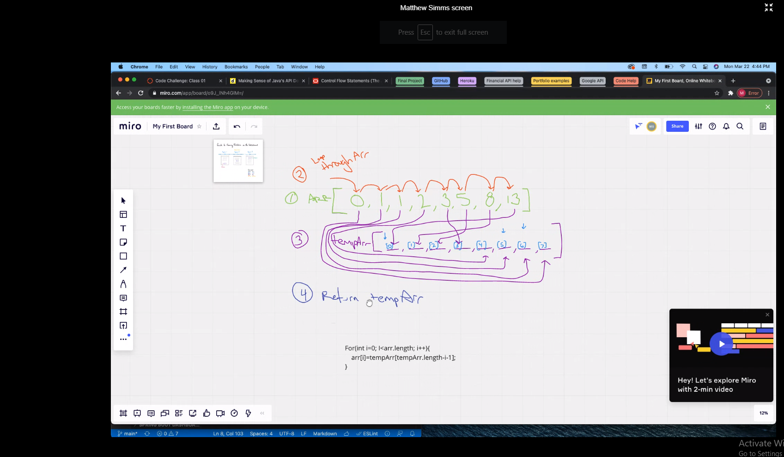

# data-structures-and-algorithms2

# Code Challenge 05
## Linked list implementation.
- Can successfully instantiate an empty linked list
- Can properly insert into the linked list
- The head property will properly point to the first node in the linked list
- Can properly insert multiple nodes into the linked list
- Will return true when finding a value within the linked list that exists
- Will return false when searching for a value in the linked list that does not exist
- Can properly return a collection of all the values that exist in the linked list

## I started with the class LinkedList to instantiate the linked-list
## insert() allows for the insertion of new nodes
## display() displays the print out of the Node.
## includes() allows the search of the Node for specific data.
#Code Challenge 6 
## Feature Task 
### - .append(value) which adds a new node with the given value to the end of the list
- .insertBefore(value, newVal) which add a new node with the given newValue immediately before the first value node
- .insertAfter(value, newVal) which add a new node with the given newValue immediately after the first value node
