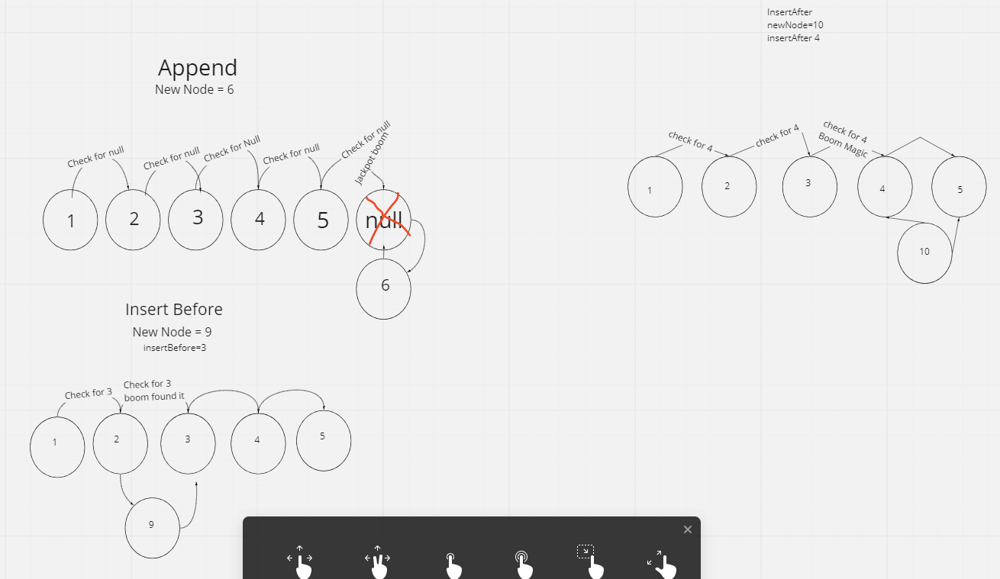
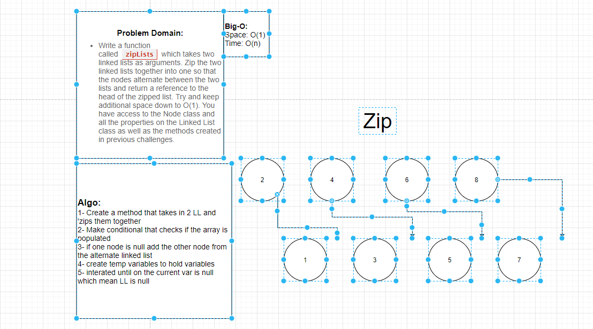
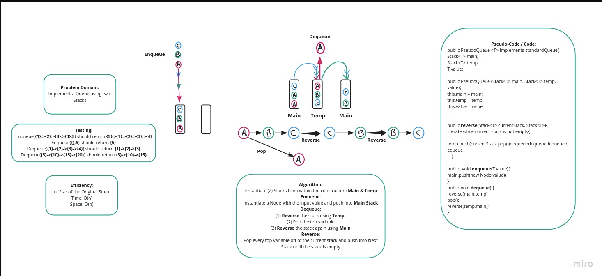

# data-structures-and-algorithms2

# Code Challenge 05
## Linked list implementation.
- Can successfully instantiate an empty linked list
- Can properly insert into the linked list
- The head property will properly point to the first node in the linked list
- Can properly insert multiple nodes into the linked list
- Will return true when finding a value within the linked list that exists
- Will return false when searching for a value in the linked list that does not exist
- Can properly return a collection of all the values that exist in the linked list

## I started with the class LinkedList to instantiate the linked-list
## insert() allows for the insertion of new nodes
## display() displays the print out of the Node.
## includes() allows the search of the Node for specific data.
# Code Challenge 6 
## Feature Task 
- .append(value) which adds a new node with the given value to the end of the list
- .insertBefore(value, newVal) which add a new node with the given newValue immediately before the first value node
- .insertAfter(value, newVal) which add a new node with the given newValue immediately after the first value node

## Tests

- Can successfully add a node to the end of the linked list
- Can successfully add multiple nodes to the end of a linked list
- Can successfully insert a node before a node located i the middle of a linked list
- Can successfully insert a node before the first node of a linked list
- Can successfully insert after a node in the middle of the linked list
- Can successfully insert a node after the last node of the linked list
- 

# Challenge 08

# Code Challenge 12
## Start Time 2040
## End Time 2240
### Feature Task
- Create a class called AnimalShelter which holds only dogs and cats. The shelter operates using a first-in, first-out approach.
  Implement the following methods:
- enqueue(animal): adds animal to the shelter. animal can be either a dog or a cat object.
- dequeue(pref): returns either a dog or a cat. If pref is not "dog" or "cat" then return null.

## Challenge 12 White Board.
### Worked with Leaundrae McKinney and Barrett Nance
